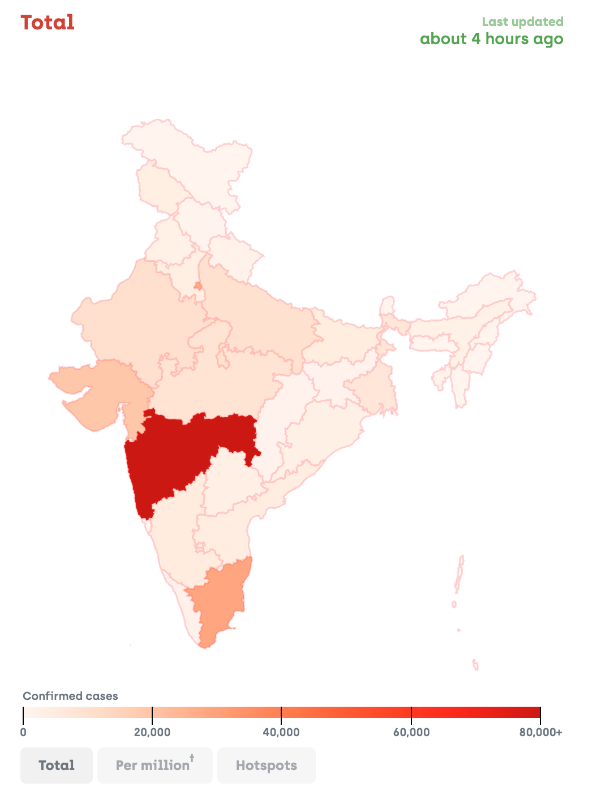
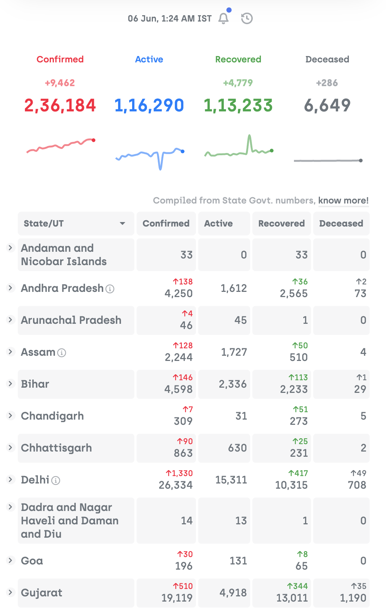

# Covid19India Dashboard Analysis

**GEOG 458: Final Essay**

**GitHub repository:** https://github.com/covid19india

<p align="center">

</p>

## Introduction

This dashboard is a crowdsource prohect that aims to track the spread of nCOVID-19 in India and the extent of the outbreak in the country. The home page primarily shows the spread of cases in India as a choropleth with a table that lists the number of cases by state and district.

I chose to analyze this dashboard for a couple of reasons. First, it is completely volunteer driven and open source, which means that this is a community response to the disease and shows how dashboards and mapping can help the community directly. Secondly, I really like how well-maintained and active it is. Given, the disease is new and widely spreading. A dev community response like this ensures that the ensures that the webapp evolves as the need evolves. Although, the project started as a dashboard only to track the disease, it now also lists places where people can buy essential commodities.

The dashboard is created and maintained by "a group of dedicated volunteers". The primary function of the webapp is in **Home** tab, it is to show the spread of the cases and also to keep a track of the spread of the disease by mapping the spread between patients in the **Demographics** tab. Apart from that there is a **Essentials** tab that shows users where they can find essentials based on their current location.

The target audience for the app is the general population in India and policymakers if they choose to use the website to get their statistics. The app works well for the target audience as it has everything related to the disease and the resources they might need.

## System Architecture

The architecture for this website is very interesting. Although, there is a whole different repository for the backend API, I will talk briefly about that and limit our conversation to the client side and the services to reduce complication.

### Data

The data for the website is gathered by volunteers. Volunteers collect data from predefined, trusted sources released by different states about the patients and new cases everyday. Volunteers then update the internal Google Sheet which acts as the primary database for the for all unidentifiable patient records.

### Server

The Client (dashboard) pulls data from an [API](https://github.com/covid19india/api) made by the same organization. This API provides several endpoints (or functions) for the client to get the data from. Different parts of the webpage use different endpoints.

The server picks up its data from the Google Sheet updated by the volunteers using GitHub Actions periodically. The period of time is the trigger event for the action which is roughly once every 10 mins as seen from the [GitHub Actions](https://github.com/covid19india/api/actions). The action is defined in a [YAML file](https://github.com/covid19india/api/blob/master/.github/workflows/javascript.yml). It specifies that the action runs on an Ubuntu virtual environment. The action uses secret tokens to interact with the Google Sheets API and runs a [bash script](https://github.com/covid19india/api/blob/master/main.sh) which in turn runs all the data fetching functions defined inside the src folder as JS files. These files have functions to convert the CSV data to JSON, organize it statewise and add geocodes for states + districts into the JSON. The bash script runs a final sanity check that updates the database on GitHub if there are a predefined number of updates.

After the sanity check, the data is saved in the gh-pages branch of the repository where the server fetches data. The clients can use this data as defined by the API for their applications. As mentioned in the [JSON table](https://github.com/covid19india/api/tree/master#json) on the README page of the server repo, there are various endpoints provided by the API. These endpoints give data at various lebels about patients and cases. They also have data about different zoning levels for the districts and about essentials.

### Services

On the backend the app majorly uses GitHub Actions and Google Sheets API. Apart from that there is Immer and MomentJS libraries used for the code to make immutable states and to use date and times properly. The webapp also uses a lot of services on the frontend. The frontend client (dashboard) uses the backend API as a service. It also uses Google Fonts for different kinds of text on the client. There is also usage of Google Tag Manager to collect analytics about the usage of the website. For mapping, the website uses state, district and country boundary GeoJSONs derived from Indian government websites and D3 library to show those regions as a choropleth.

### Client

The client side is made using the React framework which allows for reusable components and easier data flow throughout the app. The client side uses D3 library to visualize the map and for other charting elements as well. The client features multiple tabs for different resources, alongwith a homepage that displays the statistics of the disease using spread trends with uniform and logarithmic graphs. alongwith a map of India that displays the choropleth. This map can also be switched to show hotspots in the country using a bubble map. Clicking on a state on the map also shows the various districts inside the state and their statistics. This is also bound with the table of statistics on the side as the state's cell opens up. The frontend uses a lot of different libraries. It uses Leaflet for distance mapping for resources. It also uses Spring for state change animations and hover effects on the map. On the bottom left part of the app, there is also a button to change the theme of the website to make it dark mode.

## Code Inspection

### Network

Looking at the code for the website there are numerous things that I noticed. It took about 0.4 seconds for the website to first load, which means in less than a half a second the website is interactive, which is pretty good considering the amount of elements on the page.

Apart from that the website also pulls data from the API, precompiled CSS, minified JS code and the geoJSON for the regions using HTTP requests.

### JS Framework

As mentioned before, the webapp uses [React](https://reactjs.org/) which means that there are custom components on the page representing each `<div>` element. It uses a Virtual DOM to add elements to the page unlike the regular DOM. The dashboard also uses [React-Router-DOM](https://www.npmjs.com/package/react-router-dom) to manage different tabs for the website. This is done in such a code:

```javascript
<Router>
  ...
  <Route exact path="/">
    <Home />
  </Route>
  ...
</Router>
```

### CSS Framework

This is a simplified version of the code that sees the path in the URL and puts the Home component inside the DOM. This code can be seen in the [App.js](https://github.com/covid19india/covid19india-react/blob/master/src/App.js) file.

A very important reason of why the app looks so neat is because of its CSS styling but in this case, the app uses Sass for styling. Sass is a preprocessor for CSS that lets the developers add variable names for things like colors and have logic built into the CSS as well. This is helpful as the developer does not have to copy paste the same color codes with lighter and darker variations everywhere.

```scss
$blue: #007bff;
$blue-light: #007bff10;
$blue-hover: #007bff30;
$blue-light-opaque: #eff7ff;
...
```

In this case we can see that a list of colors are defined for both light mode and dark mode in the [App.scss](https://github.com/covid19india/covid19india-react/blob/master/src/App.scss) file.

### Major Visual Components

There are 2 major components on the home page. The table that lists all the cases on the left and the map of India on the right. Hovering on any state on the map also highlights the state row in the table as well.

#### Map

<p align="center">

</p>

The map is a choropleth of all the confirmed cases in the country by default. This can be changed by clicking the tabs on the top that show active, recovered, deceased and tested choropleths as well. When a state is clicked on, all the different district in the state are shown as a choropeth and we can see the district level trends. The summary statistics and the spread trends charts underneath the map also change based on the state selection. The data about the boundaries of states and the country is pulled from Indian government websites. The projection used for these boundaries is Transverse Mercator as shown from the GeoJSON codes. Every district has a district code, a name, a statename and a statecode as well which are used as indices.

#### Data Table

<p align="center">

</p>

The data table on the left indicates the statistics about each state and the state is highlighted on the map as the table row is hovered on. Clicking on each state leads to a separate page with details about the state and data from it.

### Responsiveness

This dashboard works well on different sizes. I tested it on the laptop screen, an extended screen and a mobile screen using the chrome inspector devices tool. On smaller screen, the website uses a single column layout where the map is pushed below the data table. On a larger screen, there are two columns. The code uses [@juggle/resize-observer](https://github.com/juggle/resize-observer) to keep a track of the size of the screen and adjsut the components on the page respectively.

## Data Sources

This webapp dashboard uses multiple data sources. For crowdsourcing the patient data it relies on the different state used form of broadcast. Some states publish their patient data on their websites (like Delhi's cases on June 5: [here](https://delhifightscorona.in/wp-content/uploads/2020/06/06-05.pdf)), which the volunteers then pull and then put on the Google Sheets, while some states have twitter bots (like Bihar's cases on June 4: [here](https://twitter.com/BiharHealthDept/status/1268574660280680455/photo/1)) that release this data. All this data is accessed via this API: https://github.com/covid19india/api#json that the backend provides and formats well for the dashboard to use.

Apart from that it also crowdsources the data for essentials and resources for each state, so that people can see where they can find essential items around them during the lockdown imposed by the government. This is fetched with the backend API again. The endpoint for which is: https://api.covid19india.org/resources/resources.json.

## Basemap

This dashboard does not use a basemap which could be one of its fallacies. This could be because the area where the map is shown changes when an area is clicked on and thus the background would change very frequently as well. Or it could be just for aesthetic purposes. However, on digging deeper, I found that the GeoJSONs used have a default topological basemap which is rendered on GitHub for each state's GeoJSON.

## Web Map Elements

The web map has three major elements.

| Element             | Description                                                                                                                                   |
| ------------------- | --------------------------------------------------------------------------------------------------------------------------------------------- |
| 📏 Scale            | There is a choropleth scale right under the map that specifies the level of intesnity for each statistics.                                    |
| 🎛 Nav Buttons       | There are a couple of nav buttons on the top right of the map that leads to the full map when on state level or to the page's state.          |
| 🔢 Region Statistic | The statistic on the top left shows what the statistic of the cases is for the selected region. This changes as the scope of the map changes. |

## Strengths and Weaknesses

Like any other website/dashboard/mapping service. This website has its pros and cons. While it excels in design and responsiveness, it fails to provide a geographic sense alongwith the map.

### Strengths

1. Good CSS and design which includes a dark and a light mode.
2. Translation which includes many regional languages of India so that the website is accessible to the targeted audience.
3. The website serves more than just a dashboard by providing links for essential services and resources to the people.

### Weaknesses

1. Lack of geographic context. By choosing not to add a basemap, the website takes away from the experience as the user cannot imagine themselves as the location as there is no satellite imagery or any kind of a basemap to provide visual and locational context.
2. Zoom levels. By choosing D3 as their mapping library, it takes away the exprience of zoom levels that a map provides.

## Interesting Observations

While researching this project and looking at various code sources, I came across a few interesting observations.

- In the repository for the frontend code I found that GitHub uses Leaflet tile panes to show a basemap when a GeoJSON fule is uploaded. For example, this district boundaries for the state of [Maharashtra](https://github.com/covid19india/covid19india-react/blob/master/public/maps/maharashtra.json) are shown in blue while an OpenStreetMap basemap is used and it is shown on a MapBox container.

- For the frontend code, I also found that the dashboard uses K Nearest Neighbors algorithm to calculate which essential services might be near the user based on their location. The code uses Leaflet-friendly KNN [library](https://github.com/mapbox/leaflet-knn) provided by MapBox to calculate this.

## Reflection

Apart from the technical observations, while going through this project and analyzing the functions that it serves, I also realized the social aspects of the project.

A lot of modern projects, maps, dashboards are made in a single language. This website uses local translations for the locations on the map apart from general translation of the entire website as well in multiple regional languages. This not only increases accessibility of the website but also increases the audience for the website. In India, currently there is a big digital divide because of two reasons. First, technology is expensive to purchase and second, content is only available in a certain number of languages. Getting a smartphone these days has become relatively cheaper which makes buying the technology accessible but what remains a problem of concern is having quality content in local languages. This issue is addressed very well by the contributors of this smart dashboard.

As a smart dashboard, this website is essentially a resource of urban data for not only the public but also policy makers. As Kitchin et al, write in their paper, _The praxis and politics of building urban dashboards_ that simply distilling down a social phenomenon into numbers is not enough. As these numbers are "objective and value-free", it is important that the contributors of this or any dashboard realize that these numbers represent actual lives of human beings. While looking at the number of deaths and suggesting that a city is relatively free of nCovid-19, it is important to recognize that these are actual lives that we lost due to the disease. Providing such a humanitarian context is hard to do using smart dashboards. Being a socio-technical assemblage, a dashboard (especially one that tracks a disease) could potentially provide this social context through stories and news articles.

## References Used:

- https://www.sciencedirect.com/science/article/abs/pii/S0016718515300245
- https://www.covid19india.org/
- https://github.com/covid19india
- https://www.covid19india.org/about
- https://www.mohfw.gov.in/
- https://github.com/mapbox/leaflet-knn
- https://reacttraining.com/react-router/
- https://reactjs.org/
- https://sass-lang.com/
